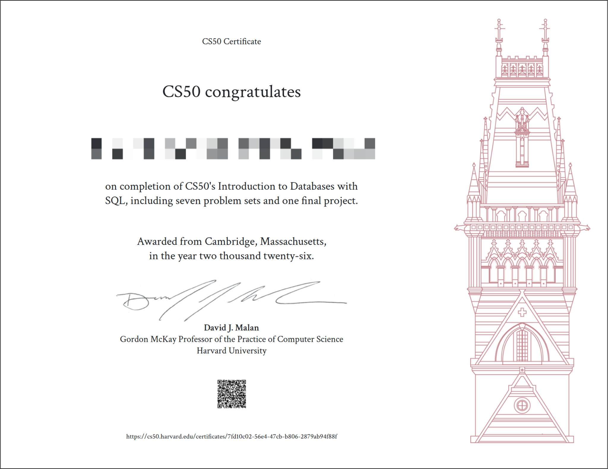

# CS50sql

[CS50’s Introduction to Databases with SQL](https://cs50.harvard.edu/sql/)

- [Week 0 - Querying](./week0-querying/README.md) 
- [Week 1 - Relating](./week1-relating/README.md) 
- [Week 2 - Designing](./week2-designing/README.md) 
- [Week 3 - Writing](./week3-writing/README.md) 
- [Week 4 - Viewing](./week4-viewing/README.md)
- [Week 5 - Optimizing](./week5-optimizing/README.md)
- [Week 6 - Scaling](./week6-scaling/README.md)

_*This repository serves as my personal storage and practice space for CS50’s Introduction to Databases with SQL (CS50sql). All problem sets, exercises, and experiments related to the course will be stored here.*_

### Certificate
